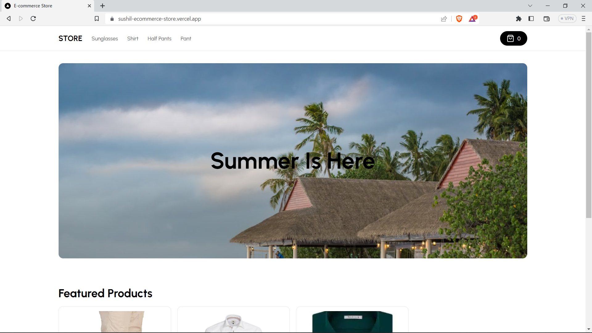

# Full Stack E-Commerce Admin with Next.js 13, Clerk, Stripe, App Router, React, Shadcn UI, Tailwind, Prisma, MySQL, Planet Scale, NextAuth 2023

#### [https://sushil-ecommerce-store.vercel.app](https://sushil-ecommerce-store.vercel.app/)

### MAKE SURE YOU HAVE [ADMIN](https://sushil-ecommerce-store.vercel.app/) SETUP FIRST!

### Features:

- We will be using Shadcn UI for the Admin!
- Our admin dashboard is going to serve as both CMS, Admin and API!
- You will be able to control mulitple vendors / stores through this single CMS! (For example you can have a "Shoe store" and a "Laptop store" and a "Suit store", and our CMS will generate API routes for all of those individually!)
- You will be able to create, update and delete categories!
- You will be able to create, update and delete products!
- You will be able to upload multiple images for products, and change them whenever you want!
- You will be able to create, update and delete filters such as "Color" and "Size", and then match them in the "Product" creation form.
- You will be able to create, update and delete "Billboards" which are these big texts on top of the page. You will be able to attach them to a single category, or use them standalone (Our Admin generates API for all of those cases!)
- You will be able to Search through all categories, products, sizes, colors, billboards with included pagination!
- You will be able to control which products are "featured" so they show on the homepage!
- You will be able to see your orders, sales, etc.
- You will be able to see graphs of your revenue etc.
- You will learn Clerk Authentication!
- Order creation
- Stripe checkout
- Stripe webhooks
- MySQL + Prisma + PlanetScale



### Prerequisites

**Node version 14.x**

### Cloning the repository

```shell
git clone https://github.com/iprime2/ecommerce-store-nextjs-ts
```

### Install packages

```shell
npm install
```

### Setup .env file


```js
NEXT_PUBLIC_CLERK_PUBLISHABLE_KEY=
CLERK_SECRET_KEY=
NEXT_PUBLIC_CLERK_SIGN_IN_URL=
NEXT_PUBLIC_CLERK_SIGN_UP_URL=
NEXT_PUBLIC_CLERK_AFTER_SIGN_IN_URL=
NEXT_PUBLIC_CLERK_AFTER_SIGN_UP_URL=
DATABASE_URL=
NEXT_PUBLIC_CLOUDINARY_CLOUD_NAME=
CLOUDINARY_URL=
STRIPE_API_KEY=
FRONTEND_STORE_URL=
STRIPE_WEBHOOK_SECRET=
```
 
### Setup Prisma

```shell
npx prisma generate
npx prisma db push

```

### Start the app

```shell
npm run dev
```

## Available commands

Running commands with npm `npm run [command]`

| command         | description                              |
| :-------------- | :--------------------------------------- |
| `dev`           | Starts a development instance of the app |
| `lint`          | Check any javascript error               |
| `build`         | To build the webapp                      |
