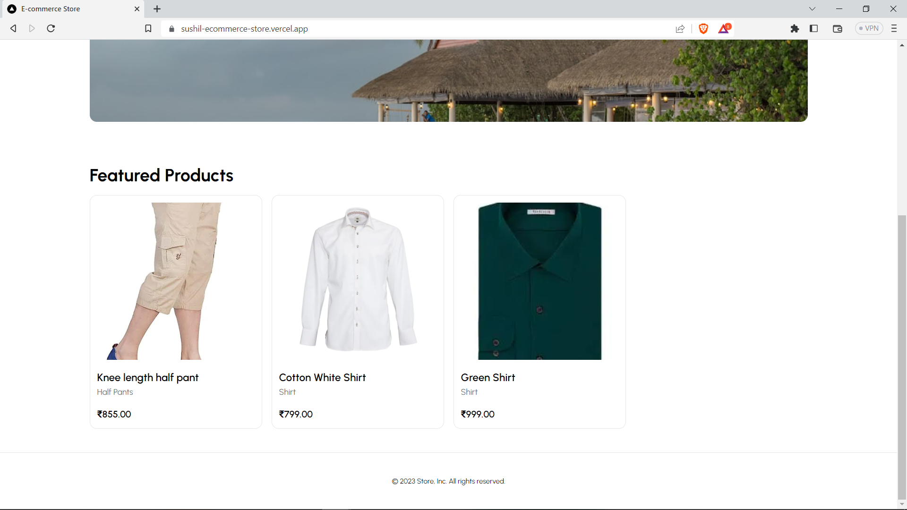

# Full Stack E-Commerce Store with Next.js 13, Stripe, App Router, Typescript, and Tailwind.

#### [https://sushil-ecommerce-store.vercel.app](https://sushil-ecommerce-store.vercel.app)

### MAKE SURE YOU HAVE [ADMIN](https://github.com/iprime2/ecommerce-store-nextjs-ts) SETUP FIRST!

### Features:

- Users can create their own online e-commerce store and manage the data from the admin
- The data will be fetched from admin store APIs
- Users can use filters to narrow down the product selection or search for specific products.
- Stripe checkout
- Page loading state
- Tailwind design
- Tailwind animations and effects
- Full responsiveness
- Server error handling using react-toast




### Prerequisites

**Node version 14.x**

### Cloning the repository

```shell
git clone https://github.com/iprime2/ecommerce-store-nextjs-ts
```

### Install packages

```shell
npm install
```

### Setup .env file


```js
NEXT_PUBLIC_API_URL=
```
 
### Setup Prisma

```shell
npx prisma generate
npx prisma db push

```

### Start the app

```shell
npm run dev
```

## Available commands

Running commands with npm `npm run [command]`

| command         | description                              |
| :-------------- | :--------------------------------------- |
| `dev`           | Starts a development instance of the app |
| `lint`          | Check any javascript error               |
| `build`         | To build the webapp                      |
